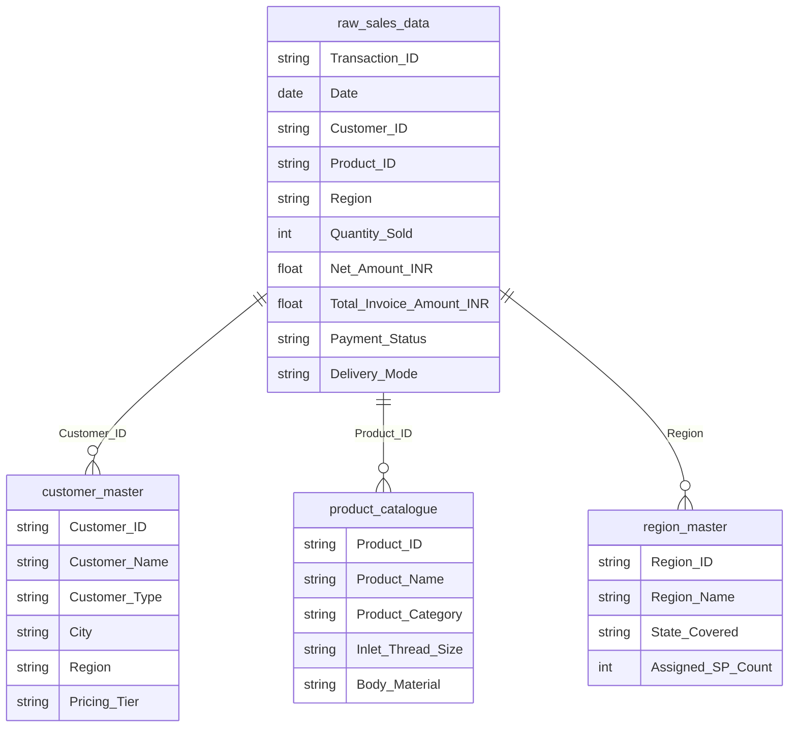

# Bhartiya Valves — Sales & Marketing Analytics (Excel → SQL → Power BI)

End-to-end data analytics project built during a Sales & Marketing Analytics internship at **Bhartiya Valves (P) Ltd.**, a Faridabad-based (Est. 1989) manufacturer of high-pressure brass gas cylinder valves. Full pipeline from raw transactional data to a 7-page interactive Power BI dashboard, covering 3.5 years of business — including a real revenue dip investigated end-to-end, from root cause to recovery.

> Also completed as part of the B.Tech CSE curriculum at Echelon Institute of Technology, Faridabad (affiliated to J.C. Bose University of Science & Technology).

## Project Scale

| Metric | Value |
|---|---|
| Transactions analyzed | 1,03,842 |
| Time span | 3.5 years (Jan 2023 - Jun 2026) |
| Database tables | 10 (normalized, primary/foreign-key linked) |
| Performance indexes | 22 |
| SQL analytical queries | 53 |
| Stored procedures | 6 |
| SQL views | 3 |
| DAX measures | 44 |
| Dashboard pages | 7 |

## The Business Story

Bhartiya Valves saw a sharp revenue dip between May-September 2024. This project traces that dip end-to-end: from raw transaction data, through SQL root-cause analysis (which region, which product, which customer segment was hit hardest), to a quantified 2025 recovery — the same pipeline a company's internal BI team would build to answer "what happened, and what do we do about it."

## Dashboards

Click any heading below to jump straight to that dashboard's full-size image.

### [1. Executive Summary](./powerbi/screenshots/01_executive_summary.png)
[](./powerbi/screenshots/01_executive_summary.png)

### [2. Regional Performance](./powerbi/screenshots/02_regional_performance.png)
[](./powerbi/screenshots/02_regional_performance.png)

### [3. Product Analysis](./powerbi/screenshots/03_product_analysis.png)
[](./powerbi/screenshots/03_product_analysis.png)

### [4. Customer & Salesperson Dashboard](./powerbi/screenshots/04_customer_salesperson.png)
[](./powerbi/screenshots/04_customer_salesperson.png)

### [5. Marketing Analytics: Extended Reach](./powerbi/screenshots/05_extended_reach.png)
[](./powerbi/screenshots/05_extended_reach.png)

### [6. Dip Analysis 2024](./powerbi/screenshots/06_dip_analysis_2024.png)
[](./powerbi/screenshots/06_dip_analysis_2024.png)

### [7. Recovery and Recommendations](./powerbi/screenshots/07_recovery_recommendations.png)
[](./powerbi/screenshots/07_recovery_recommendations.png)

### Power BI Model Schema
[](./powerbi/screenshots/power_bi_model_schema.png)

Full Power BI file: [`powerbi/BHARTIYA_VALVES_PROJECT.pbix`](./powerbi/BHARTIYA_VALVES_PROJECT.pbix) · All 44 DAX formulas: [`powerbi/DAX_measures.md`](./powerbi/DAX_measures.md)

## Raw Data & Workbooks

Click any item below to jump straight to that file or folder.

| Data | Link |
|---|---|
| Raw sales data (Excel) | [`excel/Raw_Sales_Data.xlsx`](./excel/Raw_Sales_Data.xlsx) |
| Raw sales data (CSV, MySQL-import-ready) | [`data/sales/raw_sales_data.csv.gz`](./data/sales/raw_sales_data.csv.gz) |
| KPI Tracker workbook | [`excel/KPI_Tracker.xlsx`](./excel/KPI_Tracker.xlsx) |
| Sales Analysis workbook | [`excel/Sales_Analysis_Workbook.xlsx`](./excel/Sales_Analysis_Workbook.xlsx) |
| Marketing Analytics workbook | [`excel/Marketing_Analytics_Workbook.xlsx`](./excel/Marketing_Analytics_Workbook.xlsx) |
| Sales Targets vs. Achievement workbook | [`excel/Sales_Targets_vs_Achievement.xlsx`](./excel/Sales_Targets_vs_Achievement.xlsx) |
| Customer Master | [`excel/Customer_Master.xlsx`](./excel/Customer_Master.xlsx) · [`data/master/customer_master.csv`](./data/master/customer_master.csv) |
| Product Master | [`excel/Product_Master.xlsx`](./excel/Product_Master.xlsx) · [`data/master/product_catalogue.csv`](./data/master/product_catalogue.csv) |
| Region Master | [`excel/Region_Master.xlsx`](./excel/Region_Master.xlsx) · [`data/master/region_master.csv`](./data/master/region_master.csv) |
| All 10 SQL-import CSVs | [`data/master/`](./data/master/) and [`data/sales/`](./data/sales/) |
| Dataflow architecture diagram | [`powerbi/dataflow_architecture.png`](./powerbi/dataflow_architecture.png) |

## Architecture


**Pipeline stages:**
1. **Excel** — raw sales ledger cleaned and analyzed across 7 formula-driven workbooks (KPI Tracker, Sales Analysis, Marketing Analytics, Targets vs. Achievement, plus Customer/Product/Region masters). See [`excel/`](./excel/).
2. **MySQL** — 10-table normalized schema loaded from CSV, 22 performance indexes, 53 analytical queries across 4 tiers (Basic -> Intermediate -> Advanced window functions -> Dip & Recovery analysis), 6 parameterized stored procedures, 3 views feeding Power BI directly. See [`sql/`](./sql/).
3. **Power BI** — star-schema model, 44 DAX measures (time intelligence, dynamic ranking, dip/recovery calculations), 7 dashboard pages. See [`powerbi/`](./powerbi/).

## Data Model

MySQL database with **10 tables**: one transactional fact table, three core dimensions, three bridge/mapping tables, and three pre-aggregated reporting tables (targets and KPIs). Full DDL in [`sql/01_schema_creation.sql`](./sql/01_schema_creation.sql).



**Core star schema (fact + 3 dimensions):** `raw_sales_data` (fact, 103,842 rows) joins to `customer_master`, `product_catalogue`, and `region_master`.

**Bridge tables:** `region_salesperson_map`, `region_city_map`, `region_deliverymode_map`.

**Pre-aggregated reporting tables** (feed the KPI Tracker and Targets vs. Achievement dashboards): `kpi_dashboard`, `sales_targets_monthly`, `sales_targets_region`.

**Power BI model:** loads 9 core tables (customer_master, product_catalogue, raw_sales_data, kpi_dashboard, sales_targets_monthly, the 3 SQL views, plus a custom Calendar date table). Confirmed from the actual Model view ([`powerbi/screenshots/power_bi_model_schema.png`](./powerbi/screenshots/power_bi_model_schema.png)):

- `raw_sales_data` (*) → `product_catalogue` (1) on `Product_ID`
- `raw_sales_data` (*) → `customer_master` (1) on `Customer_ID`
- `raw_sales_data` (*) → `Calendar` (1) on `Date`

This is the real star schema: one fact table, three dimension relationships (Product, Customer, and Date/Calendar), which is what powers all the time-intelligence DAX measures (`SAMEPERIODLASTYEAR`, year-over-year comparisons, etc).

## SQL Layer

| File | Contents |
|---|---|
| [`01_schema_creation.sql`](./sql/01_schema_creation.sql) | All 10 `CREATE TABLE` statements + `LOAD DATA INFILE` for all 10 CSVs |
| [`02_indexes.sql`](./sql/02_indexes.sql) | 22 performance indexes, each commented with the query pattern it supports |
| [`03_analysis_queries.sql`](./sql/03_analysis_queries.sql) | 53 queries: Section A (8 basic), B (20 intermediate — joins, pivots), C (15 advanced — window functions, CTEs, RANK/ROLLUP), D (10 — dip timeline, root cause, 2025 recovery, management recommendations) |
| [`04_procedures_and_views.sql`](./sql/04_procedures_and_views.sql) | 6 stored procedures (`GetRevenueByRegion`, `GetTopNCustomers`, `GetSalespersonScorecard`, `GetDipAnalysis`, `GetProductPerformance`, `GetPaymentCollectionReport`) + 3 views (`vw_monthly_revenue_summary`, `vw_customer_360`, `vw_region_product_summary`) |

## Skills Demonstrated

| Area | What Was Done |
|---|---|
| Data Modeling | 10-table normalized schema, PK/FK relationships, 22 performance indexes |
| SQL | Window functions, CTEs, RANK/DENSE_RANK, ROLLUP, correlated subqueries |
| Automation | 6 parameterized stored procedures for repeatable reporting |
| BI Engineering | 3 SQL views feeding Power BI directly — no manual refresh needed |
| DAX | Time intelligence (`SAMEPERIODLASTYEAR`), dynamic ranking (`RANKX`/`TOPN`) |
| Debugging | 6 real bugs found and fixed during development (below) |

## Data Cleaning & Debugging Highlights

Real issues found and fixed while building the pipeline:

| Issue | Root Cause | Fix |
|---|---|---|
| `YEAR()` / date formulas failing | Dates stored as text, not true Excel dates | Reformatted `Date` column to proper datetime |
| 42-59 duplicate customer names | Same customer entered under multiple `Customer_ID`s | Deduplicated by ranking on `Customer_ID` |
| Power BI showing a "(Blank)" product category | `PRD-012` (Spindle Keys & Spares) missing from `Product_Master` | Added missing product dimension row |
| Haryana cities (Rohtak, Panipat, Karnal) excluded from NCR | Incorrect manual region mapping | Corrected using the official NCR Planning Board 14-district list |
| Power BI TOPN/SUMMARIZE measures not responding to year slicer | Static ranking logic | Rebuilt with `ADDCOLUMNS` + `RANKX` |
| Achievement Rate % showing 9496% instead of ~95% | Percentage value multiplied twice (once in the measure, once in formatting) | Removed duplicate `*100` |

## Key Findings

*(Net revenue, ex-GST, Jan 2023 - Jun 2026)*

- **Total net revenue:** Rs 77.39 crore across 103,842 transactions and 1,479,676 units sold.
- **Regional concentration:** Delhi NCR alone drives 38.0% of revenue, followed by Haryana (18.0%) and Uttar Pradesh (15.0%) — the top 3 regions account for 71% of total revenue.
- **Product mix:** Industrial Valves dominate at 78.5% of revenue, with Medical Valves at 14.3% and Fire Fighting Valves at 6.1%.
- **Sales team:** 15 salespeople; the top 3 together handle ~48% of all transactions.
- **2024 dip:** A documented May-September 2024 revenue dip, traced to its root cause and quantified through 2025 recovery — full investigation in `sql/03_analysis_queries.sql` Section D.
- **Target achievement:** Monthly and regional targets tracked with automated Met/Missed/On Track status flags.

## AI-Assisted Workflow (Used as a Tool, Not a Crutch)

Every data model, SQL query, DAX formula, and business insight in this project is mine. AI was used deliberately for:
- Debugging (e.g. tracing the RANKX slicer bug, the double-multiplication percentage bug)
- Documentation generation (this README, the DAX reference doc)
- Cross-checking SQL output against Excel formulas for accuracy

Knowing when and how to use AI, without letting it replace analytical judgment, is part of how I work.

## Repo Structure

```
├── data/
│   ├── master/          # 9 dimension/bridge/reporting tables, MySQL-import-ready CSVs
│   └── sales/            # Fact table - 103,842-row transaction ledger (gzip)
├── excel/                 # 8 original workbooks (raw data + 7 analysis workbooks)
├── sql/                    # Schema, indexes, 53 queries, 6 procedures + 3 views
├── powerbi/               # .pbix file, DAX measure docs, dashboard screenshots
└── README.md
```

## Tech Stack

`Excel (Advanced formulas, PivotTables)` - `MySQL / MySQL Workbench (joins, views, stored procedures, indexing)` - `Power BI Desktop (star schema, DAX)`

## Business Questions Answered

- Which regions and products drive the most revenue, and where is growth slowing?
- Are salespeople hitting their monthly/quarterly targets, and by how much?
- What does the customer base look like by segment, pricing tier, and order value?
- Which delivery channels and payment methods are most used, and what's the collection rate on outstanding payments?
- What caused the 2024 revenue dip, and what changed in the 2025 recovery?

## Author

**Ankita Bisht** — B.Tech CSE, Echelon Institute of Technology, Faridabad
[LinkedIn](https://linkedin.com/in/ankita-bisht09) - [GitHub](https://github.com/ankitabisht-data-analyst)
